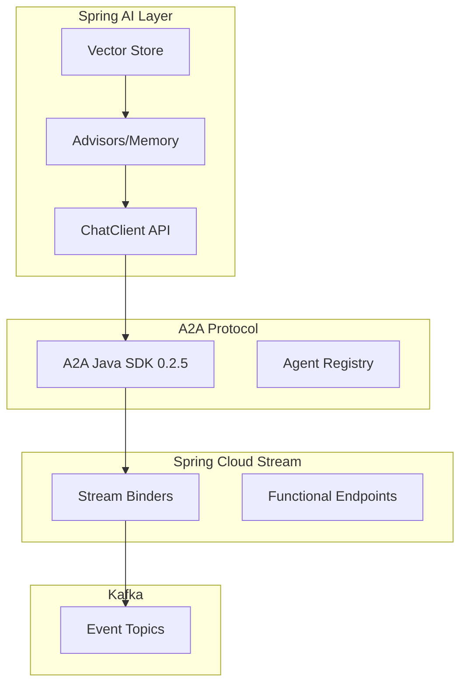

# Product Requirements Document (PRD)

**Title:** Reference Implementation — Spring AI Application with A2A Protocol over Kafka  
**Version:** v2.0  
**Date:** 2025-08-20  

---

## 1. Executive Summary

This project delivers a reference demo application showcasing Spring AI agents communicating via the A2A (Agent-to-Agent) protocol using Apache Kafka as the messaging backbone. The implementation leverages **Spring AI 1.0.1** for LLM operations and **A2A Java SDK 0.2.5** for standardized agent communication, avoiding reinvention of existing capabilities.

### Key Technology Stack
- **Spring AI 1.0.1** - Production-ready AI framework with built-in agent patterns
- **A2A Java SDK 0.2.5** - Official protocol implementation
- **Spring Cloud Stream 2025.0.0** - Event-driven microservices with Kafka
- **Spring Boot 3.5.x** - Virtual threads support for concurrent agent processing
- **Model Context Protocol (MCP)** - Alternative/complementary agent communication

---

## 2. Objectives

- ✅ Demonstrate A2A protocol over Kafka using official SDKs
- ✅ Leverage Spring AI's built-in agent patterns (orchestrator-workers, routing, chaining)
- ✅ Implement multi-agent workflows without reinventing existing capabilities
- ✅ Use Spring Cloud Stream for reactive agent communication
- ✅ Provide monitoring dashboard with minimal complexity
- ✅ Create reusable patterns for production systems

---

## 3. Architecture

### 3.1 Core Components

```yaml
Services:
  - Orchestrator Agent: Spring AI ChatClient with routing advisors
  - Translator Agent: Spring AI with translation models
  - Summarizer Agent: Spring AI with summarization chains
  - LLM Agent: General-purpose Spring AI ChatClient
  - Registry Service: A2A SDK agent registry
  - Monitoring Bridge: Spring WebFlux SSE endpoint
```

### 3.2 Technology Integration



---

## 4. Implementation Details

### 4.1 Maven Dependencies

```xml
<properties>
    <spring-boot.version>3.5.0</spring-boot.version>
    <spring-ai.version>1.0.1</spring-ai.version>
    <spring-cloud.version>2025.0.0</spring-cloud.version>
    <a2a-sdk.version>0.2.5</a2a-sdk.version>
</properties>

<dependencyManagement>
    <dependencies>
        <!-- Spring AI BOM -->
        <dependency>
            <groupId>org.springframework.ai</groupId>
            <artifactId>spring-ai-bom</artifactId>
            <version>${spring-ai.version}</version>
            <type>pom</type>
            <scope>import</scope>
        </dependency>
        <!-- Spring Cloud BOM -->
        <dependency>
            <groupId>org.springframework.cloud</groupId>
            <artifactId>spring-cloud-dependencies</artifactId>
            <version>${spring-cloud.version}</version>
            <type>pom</type>
            <scope>import</scope>
        </dependency>
    </dependencies>
</dependencyManagement>

<dependencies>
    <!-- Spring Boot -->
    <dependency>
        <groupId>org.springframework.boot</groupId>
        <artifactId>spring-boot-starter-webflux</artifactId>
    </dependency>
    
    <!-- Spring AI Core -->
    <dependency>
        <groupId>org.springframework.ai</groupId>
        <artifactId>spring-ai-openai-spring-boot-starter</artifactId>
    </dependency>
    
    <!-- Spring AI MCP Support -->
    <dependency>
        <groupId>org.springframework.ai</groupId>
        <artifactId>spring-ai-starter-mcp-client</artifactId>
    </dependency>
    
    <!-- A2A Protocol SDK -->
    <dependency>
        <groupId>io.github.a2asdk</groupId>
        <artifactId>a2a-java-sdk-client</artifactId>
        <version>${a2a-sdk.version}</version>
    </dependency>
    <dependency>
        <groupId>io.a2a.sdk</groupId>
        <artifactId>a2a-java-sdk-core</artifactId>
        <version>${a2a-sdk.version}</version>
    </dependency>
    
    <!-- Spring Cloud Stream Kafka -->
    <dependency>
        <groupId>org.springframework.cloud</groupId>
        <artifactId>spring-cloud-stream-binder-kafka</artifactId>
    </dependency>
    
    <!-- Monitoring -->
    <dependency>
        <groupId>io.micrometer</groupId>
        <artifactId>micrometer-tracing-bridge-otel</artifactId>
    </dependency>
</dependencies>
```

### 4.2 Agent Implementation Pattern

```java
@Component
@Agent // A2A SDK annotation
public class TranslatorAgent {
    private final ChatClient chatClient;
    private final A2AClient a2aClient;
    
    @Autowired
    public TranslatorAgent(ChatClient.Builder chatClientBuilder) {
        this.chatClient = chatClientBuilder
            .defaultAdvisors(
                new MessageChatMemoryAdvisor(chatMemory())
            )
            .build();
        this.a2aClient = new A2AClient("kafka://localhost:9092");
    }
    
    @StreamListener("a2a-tasks")
    @SendTo("a2a-replies")
    public Mono<AgentResponse> translate(AgentTask task) {
        return Mono.fromCallable(() -> {
            // Use Spring AI ChatClient for translation
            String result = chatClient.prompt()
                .user(u -> u.text("Translate to {lang}: {text}")
                    .param("lang", task.getLanguage())
                    .param("text", task.getText()))
                .call()
                .content();
            
            // Wrap in A2A protocol response
            return A2AProtocol.createResponse(task, result);
        });
    }
}
```

### 4.3 Spring Cloud Stream Configuration

```yaml
spring:
  cloud:
    stream:
      function:
        definition: processAgentTasks;routeToAgents;aggregateResults
      kafka:
        binder:
          brokers: localhost:9092
          auto-create-topics: true
          configuration:
            isolation.level: read_committed
      bindings:
        processAgentTasks-in-0:
          destination: a2a.tasks
          group: agent-processors
        processAgentTasks-out-0:
          destination: a2a.replies
        routeToAgents-in-0:
          destination: a2a.orchestrator
        aggregateResults-in-0:
          destination: a2a.results
```

### 4.4 Orchestrator with Spring AI Patterns

```java
@Service
public class AgentOrchestrator {
    private final ChatClient orchestratorClient;
    
    @Bean
    public Function<Flux<OrchestratorRequest>, Flux<AgentTask>> routeToAgents() {
        return requests -> requests
            .flatMap(request -> determineAgentChain(request))
            .map(this::createAgentTasks);
    }
    
    private Mono<List<String>> determineAgentChain(OrchestratorRequest request) {
        // Use Spring AI's routing pattern
        return Mono.fromCallable(() -> 
            orchestratorClient.prompt()
                .system("You are an agent router. Determine the optimal agent chain.")
                .user(request.getQuery())
                .call()
                .entity(AgentChainDecision.class)
                .getAgentSequence()
        );
    }
}
```

---

## 5. Kafka Topic Design (Simplified)

| Topic | Purpose | Partitioning | Retention |
|-------|---------|--------------|-----------|
| `a2a.tasks` | Agent task commands | Hash(taskId) | 7 days |
| `a2a.replies` | Direct responses | Hash(taskId) | 7 days |
| `a2a.events` | Progress/streaming | Hash(taskId) | 1 day |
| `a2a.registry` | Agent metadata | Compacted | Infinite |

---

## 6. A2A Protocol Message Format

```java
@JsonSerialize
public class A2AEnvelope {
    private String id;           // UUID
    private String type;          // command|reply|event
    private String from;          // agent.translator
    private String to;            // agent.summarizer
    private String taskId;        // Correlation ID
    private String method;        // A2A method
    private Object payload;       // Task-specific data
    private Instant timestamp;
    
    // A2A SDK handles serialization
}
```

---

## 7. Monitoring Dashboard (Simplified)

### 7.1 Technology Choice
- **Frontend:** Preact (lightweight)
- **Backend:** Spring WebFlux SSE
- **Protocol:** Server-Sent Events (no WebSocket complexity)

### 7.2 Implementation

```java
@RestController
@RequestMapping("/api/monitor")
public class MonitoringController {
    
    @GetMapping(value = "/stream", produces = MediaType.TEXT_EVENT_STREAM_VALUE)
    public Flux<ServerSentEvent<AgentEvent>> streamEvents() {
        return kafkaReceiver
            .receive()
            .map(record -> ServerSentEvent.<AgentEvent>builder()
                .data(record.value())
                .event(record.value().getType())
                .id(record.value().getId())
                .build())
            .doOnError(error -> log.error("SSE stream error", error))
            .retry(3);
    }
}
```

---

## 8. Development Phases (Simplified)

### Phase 1: Core Setup (Day 1)
- Spring Boot project with Spring AI and A2A SDK
- Kafka setup via Docker Compose
- Basic ChatClient configuration

### Phase 2: Agent Implementation (Day 2-3)
- Translator agent with Spring AI
- Summarizer agent with streaming
- A2A protocol integration

### Phase 3: Orchestration (Day 4)
- Spring Cloud Stream setup
- Routing logic with Spring AI advisors
- Error handling and DLQ

### Phase 4: Monitoring (Day 5)
- SSE endpoint
- Preact dashboard
- Basic metrics with Micrometer

---

## 9. Docker Compose Configuration

```yaml
version: '3.8'
services:
  kafka:
    image: confluentinc/cp-kafka:7.5.0
    environment:
      KAFKA_NODE_ID: 1
      KAFKA_PROCESS_ROLES: 'broker,controller'
      KAFKA_LISTENERS: 'PLAINTEXT://0.0.0.0:9092,CONTROLLER://0.0.0.0:9093'
      CLUSTER_ID: 'MkU3OEVBNTcwNTJENDM2Qk'
    ports:
      - "9092:9092"
  
  schema-registry:
    image: confluentinc/cp-schema-registry:7.5.0
    depends_on:
      - kafka
    environment:
      SCHEMA_REGISTRY_KAFKASTORE_BOOTSTRAP_SERVERS: 'kafka:9092'
    ports:
      - "8081:8081"
  
  agents:
    build: .
    depends_on:
      - kafka
      - schema-registry
    environment:
      SPRING_PROFILES_ACTIVE: docker
      OPENAI_API_KEY: ${OPENAI_API_KEY}
    ports:
      - "8080:8080"
```

---

## 10. Key Improvements from v1

### Leveraging Existing Libraries
- **Spring AI ChatClient**: Instead of custom LLM integration
- **A2A Java SDK**: Official protocol implementation vs custom envelope
- **Spring Cloud Stream**: Reactive Kafka integration vs manual consumers
- **MCP Support**: Dual protocol capability for broader compatibility

### Simplified Architecture
- **Functional Reactive**: Using Spring Cloud Stream functions
- **Built-in Patterns**: Spring AI's orchestrator-workers pattern
- **SSE vs WebSocket**: Simpler real-time updates
- **Virtual Threads**: Better concurrency with Spring Boot 3.5

### Production Path
- **Observability**: OpenTelemetry integration built-in
- **Error Handling**: Spring Cloud Stream DLQ support
- **Scaling**: Kubernetes-ready with health checks
- **Testing**: TestContainers for integration tests

---

## 11. Configuration Examples

### 11.1 Application Properties

```yaml
spring:
  ai:
    openai:
      api-key: ${OPENAI_API_KEY}
      chat:
        model: gpt-4
        temperature: 0.7
    retry:
      max-attempts: 3
      backoff:
        initial-interval: 1000
        
a2a:
  sdk:
    agent-id: orchestrator-001
    registry-url: kafka://localhost:9092/a2a.registry
    
management:
  tracing:
    sampling:
      probability: 1.0
  metrics:
    tags:
      application: a2a-demo
```

### 11.2 Agent Registration

```java
@Configuration
public class A2AConfiguration {
    
    @Bean
    public A2ARegistry a2aRegistry() {
        return A2ARegistry.builder()
            .agent("translator", TranslatorCapabilities.class)
            .agent("summarizer", SummarizerCapabilities.class)
            .agent("llm", LLMCapabilities.class)
            .publishTo("kafka://a2a.registry")
            .build();
    }
}
```

---

## 12. Success Metrics

| Metric | Target | Measurement |
|--------|--------|-------------|
| Message Throughput | >1000 msg/sec | Micrometer metrics |
| Agent Response Time | <2 seconds | OpenTelemetry traces |
| Stream Processing Lag | <500ms | Kafka consumer metrics |
| Dashboard Update Latency | <1 second | SSE event timing |
| Error Rate | <1% | Spring Boot Actuator |

---

## 13. References and Resources

- [Spring AI Documentation](https://docs.spring.io/spring-ai/reference/)
- [A2A Protocol Specification](https://a2aprotocol.ai)
- [Spring Cloud Stream Kafka](https://spring.io/projects/spring-cloud-stream)
- [Model Context Protocol](https://modelcontextprotocol.io)
- [Spring AI Examples](https://github.com/spring-projects/spring-ai-examples)

---

## Appendix A: Quick Start Commands

```bash
# Clone and setup
git clone https://github.com/yourorg/a2a-spring-kafka-demo
cd a2a-spring-kafka-demo

# Start infrastructure
docker-compose up -d kafka schema-registry

# Run application
./mvnw spring-boot:run

# Test agent communication
curl -X POST http://localhost:8080/api/orchestrate \
  -H "Content-Type: application/json" \
  -d '{"query": "Translate and summarize this text", "text": "..."}'

# View monitoring dashboard
open http://localhost:8080/dashboard
```